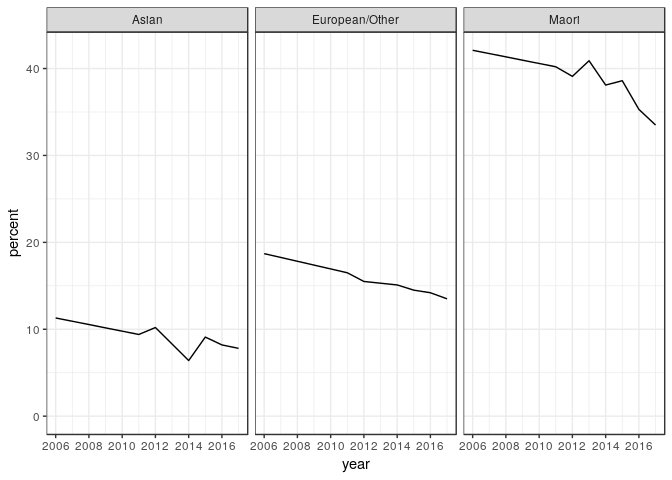
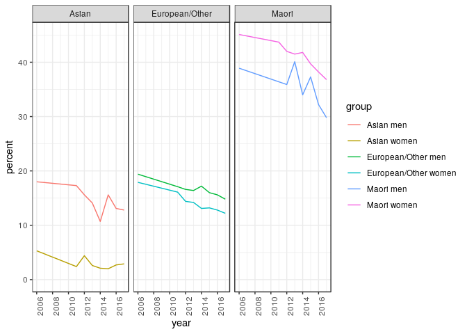

This is a brief example of how to look into the changes in smoking across the years for the NZ annual health survey. It uses the "Change over time" data set found at https://minhealthnz.shinyapps.io/nz-health-survey-2017-18-annual-data-explorer/_w_b8e82abf/#!/download-data-sets

The description of the file as provided by the Ministry of Health

> This file contains the unadjusted prevalences and means for the total population and subgroups (sex, age group, and ethnic group by sex) for 2006/07 through to 2017/18 (where available). The file also contains p-values for differences between the 2017/18 survey and previous survey years.


```r
dir.create("data")
download.file(url = "https://minhealthnz.shinyapps.io/nz-health-survey-2017-18-annual-data-explorer/_w_b8e82abf/_w_e4b6a83e/data/nz-health-survey-2017-18-annual-update-time-series.csv", destfile = "data/")
```


Load the data in and remove the first column which is the row numbers from the spread sheet.

```r
change_over_time <- read_csv("data/nz-health-survey-2017-18-annual-update-time-series.csv") %>% select(-1)
```

```
## Warning: Missing column names filled in: 'X1' [1]
```

Lets have a look at the different categories measured for adults

```r
adult_yearly_percentages <- change_over_time %>% select(population, short.description, group, contains("percent")) %>% filter(population == "adults")
```

How has smoking changed over the years?


First we need to subset the data to be the current smokers and then make the data set 'tidy' by making the percent.year into a variable called year, and a variable called percent. Finally we'll strip out the word percent from the year column and make it numeric.

```r
current_smokers <- adult_yearly_percentages %>% 
  filter(short.description == "Current smokers") %>% 
  gather(key = "year", value =  "percent", contains("percent")) %>% 
  mutate(year = str_remove(year, "percent\\.") %>% as.numeric() + 2000) %>% 
  mutate(year = lubridate::parse_date_time(as.character(year), orders = "y"))
```

Lets plot the total smoking percentages by year


```r
current_smokers %>% filter(group == "Total") %>% ggplot(aes(x = year, y = percent)) + geom_line() + expand_limits(y=0)
```

<!-- -->

We can see that smoking rates have been decreasing.

Now we can start looking in to specfic groupings.

Lets create 3 groupings: smoking by gender, ethnicity, and smoking by age

```r
smoking_by_gender <- current_smokers %>% filter(group %in% c( "Men", "Women"))

smoking_by_age <- current_smokers %>% filter(str_detect(group, '[0-9]'))

smoking_by_ethnicity <- current_smokers %>% filter(str_detect(group, 'Maori|Asian|European')) %>% 
  mutate(ethnicity = 
           case_when(str_detect(group, "Maori") ~ "Maori", 
                     str_detect(group, "Asian") ~ "Asian", 
                     str_detect(group, "European") ~ "European/Other", 
                     TRUE ~ "NA"))
```


```r
ggplot(smoking_by_gender, aes(x = year, y = percent, by = group, colour = group)) + geom_line() + expand_limits(y=0)
```

<!-- -->

From this we can see that smoking prevalence is higher in men than women for all years.


```r
smoking_by_ethnicity %>% filter(str_detect(group, 'Total')) %>% ggplot( aes(x = year, y = percent, by = group)) + geom_line() + expand_limits(y=0) + facet_wrap(~ethnicity)
```

<!-- -->


Smoking by ethnicity stratified by gender

```r
smoking_by_ethnicity %>% filter(!str_detect(group, 'Total')) %>% 
  ggplot( aes(x = year, y = percent, by = group, colour = group)) + geom_line() + expand_limits(y=0) + facet_wrap(~ethnicity) + theme(axis.text.x = element_text(angle = 90))
```

<!-- -->

